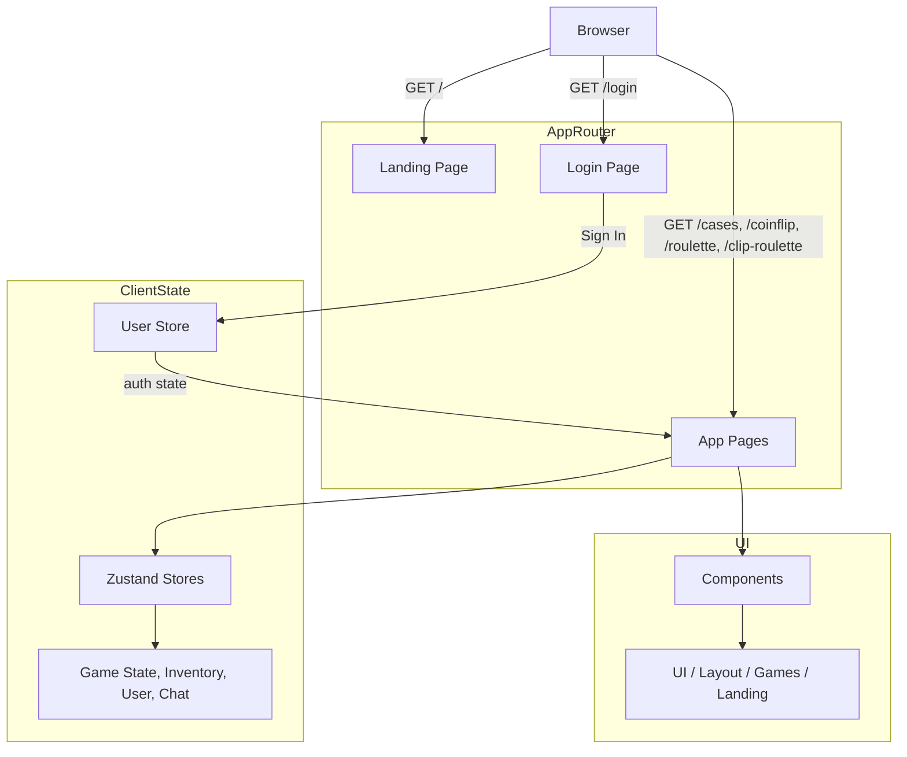

# gaming-platform

A modern Next.js gaming platform built with the App Router, Tailwind CSS, Framer Motion, and Zustand for local state management.

## Project Overview

This repository contains a fun, interactive gaming frontend with a landing experience and an app shell for games such as Case Battles, Clip Roulette, Coinflip, and Roulette.

Key features:
- Next.js App Router with server and client components
- Responsive landing page with animated hero content
- In-app gaming pages using Framer Motion and Tailwind UI
- Persistent client-side UI state via Zustand stores
- Unified login flow and protected navigation experience

## Architecture Diagram



## Folder Structure

- `app/` - Next.js App Router entrypoints, pages, and layouts
  - `(app)/` - authenticated app pages and dashboard experience
  - `(auth)/` - login page and auth flow
- `components/` - reusable UI pieces and page sections
- `lib/` - helper utilities, data definitions, and Zustand store setup
- `public/` - static assets and images

## Key Files

- `app/page.tsx` - landing page with navigation and mobile menu
- `app/(auth)/login/page.tsx` - login UI and sign-in flow
- `app/(app)/cases/page.tsx` - cases marketplace page
- `app/(app)/clip-roulette/page.tsx` - clip roulette game page
- `components/layout/nav-bar.tsx` - shared top navigation for landing and app shells
- `lib/store/game-state-store.ts` - shared game state and selected case data
- `lib/store/user-store.ts` - client-side user auth and balance state

## Running Locally

Install dependencies and start the development server:

```bash
pnpm install
pnpm dev
```

Open [http://localhost:3000](http://localhost:3000) to view the app.

## Notes

- Navigation items on the landing page currently redirect to the login page.
- The app uses Tailwind utility classes and custom gradients for the visual theme.
- The login page seeds a demo user and redirects to `/cases` after sign-in.

## Useful Commands

```bash
pnpm dev
pnpm build
pnpm lint
```
