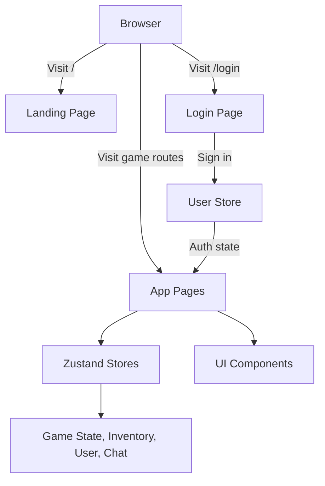

# 🎮 Gaming Platform

A polished, modern gaming experience built with Next.js, Tailwind CSS, Framer Motion, and Zustand. The project brings together a striking landing page and an interactive app shell for games like case opening, roulette, coinflip, and clip roulette.

## ✨ What this project includes

- A responsive landing experience with animated sections and a premium visual style
- Interactive in-app game views for cases, roulette, and coinflip flows
- Smooth UI transitions and polished component-based design
- Zustand-powered state management for game flow, inventory, chat, and user data
- A clean App Router structure for scalable frontend development

## 🛠️ Tech stack

- Next.js 16
- React 19
- TypeScript
- Tailwind CSS
- Framer Motion
- Zustand
- Lucide icons and shadcn-style UI primitives

## 🧩 Project structure

```text
app/              # Next.js App Router pages and layouts
components/      # Reusable UI, layout, and game components
lib/              # Utilities, data, and Zustand stores
public/           # Static assets and images
```

## 🏗️ App flow



## ▶️ Getting started

1. Install dependencies:
   ```bash
   pnpm install
   ```
2. Start the development server:
   ```bash
   pnpm dev
   ```
3. Open http://localhost:3000 in your browser.

## 📜 Available scripts

```bash
pnpm dev
pnpm build
pnpm lint
```

## ℹ️ Notes

- Some landing-page actions currently redirect to the login experience.
- The app uses a demo sign-in flow that sends users to the cases experience after login.
- The visual style leans on Tailwind utility classes, gradients, and motion-based polish.
